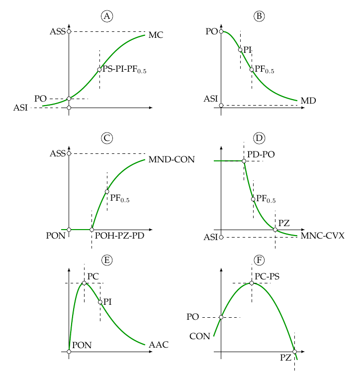

# Modelos não lineares

```{r, echo = FALSE}
read_chunk("scripts/02-estimacao.R")
```

```{r, include = FALSE}
if (isOutput("html")) {
    opts_chunk$set(out.width =  "auto")
}
```

Modelos de regressão são amplamente usados em diversas aplicações para
descrever a relação entre uma variável resposta $Y$ e uma variável
explicativa $x$.  O modelo estatístico é linear se a quantidade de
interesse, geralmente a média de $Y$, é função linear dos parâmetros,
caso contrário é não linear.  Por exemplo, em estudos de adubação a
produção média (ton) pode ser modelada como função quadrática da dose de
um nutriente (kg)
\begin{equation}
  (\#eq:quadratico)
  f(x) = a + bx + cx^2.
\end{equation}

O modelo em \@ref(eq:quadratico) é linear nos
parâmetros $a$, $b$ e $c$.  No entanto, a produção média também pode ser
modelada pela lei de Mitscherlich
\begin{equation}
  (\#eq:mitscherlich)
  f(x) = a (1 - \exp\{-b(x - c)\}),
\end{equation}
em que $a$ (ton) representa a produção máxima teórica possível quando se
aumenta indefinidamente a dose do nutriente, $b$ (kg$^{-1}$) é
interpretado como coeficiente de eficácia do nutriente, e $c$ (kg) seria
o conteúdo do nutriente no solo [@PimentelGomes2009].  Todos os
parâmetros aparecem de forma não linear em \@ref(eq:mitscherlich).  Uma
vez que pelo menos um dos parâmetros aparece de forma não linear, o
modelo é não linear.

A principal vantagem do modelo não linear sobre o linear é que 1) sua
escolha está associada ao conhecimento prévio sobre a relação a ser
modelada e 2) geralmente apresenta interpretação prática para os
parâmetros.

## Motivações

Modelos não lineares (MNL) usualmente são sustentados por alguma
informação sobre a relação entre $Y$ e $x$.  Tal informação está
vinculada à diferentes graus de conhecimento como:

  1. uma análise de um diagrama de dispersão de $y$ contra $x$ que
     sugere alguma relação funcional;
  2. restrições de forma da função (ser monótona, ser sigmóide) conforme
     necessidade do fenômeno em questão, e.g. o conteúdo acumulado de
     nutrientes liberado no solo não pode diminuir com o tempo;
  3. a solução de uma equação diferencial sustentada por algum
     príncipio/teoria que serve de premissa para o desenvolvimento do modelo;
  4. ou a necessidade de considerar uma equação que tenha interpretação
     para os parâmetros.

Seja qual for o grau de conhecimento, a escolha de um modelo não linear
raramente é empírica.

Um número crescente de pesquisadores compartilham a opinião de que as
relações entre variáveis biológicas são melhores descritas por funções
não lineares.  Processos como crescimento, decaimento, nascimento,
mortalidade, abundância, competição e produção raramente são
relacionadas linearmente às variáveis explicativas [@Schabenberger2002
capítulo 5].  Nesse sentido, pode se dizer que os MNL melhor descrevem
processos mecanísticos e são úteis por acomodarem as restrições
referentes à tais processos.  Por exemplo, em estudos de
produção-adubação sabe-se que os incrementos regulares de adubo ($x$)
não geram incrementos regulares, mas incrementos decrescentes na
produção ($Y$). Além disso espera-se que a produção irá estabilizar após
certo nível de adubação, pois passa ser limitada por outro fator, mesmo
que a adubação seja aumentada indefinidamente.  Essa é a lei do mínimo.
Mesmo não avaliando a produção sob doses extremas de adubo, pode-se
determinar qual seria o seu valor limite ao considerar um MNL
apropriado.

De maneira resumida, os MNL têm as seguintes vantagens sobre os modelos
lineares (ML):

  1. Sua escolha têm sustentação baseada em teoria ou princípios
     mecanísticos (físicos, químicos ou biológicos) ou qualquer outra
     informação prévia.
  2. Certos parâmetros são quantidade de interesse para o pesquisador
     e possuem interpretação prática.
  3. Podem ser feitas predições fora do domínio observado de $x$ quando
     o modelo é apropriado.
  4. São parsimoniosos pois tipicamente possuem poucos parâmetros,
     quase sempre com 4 ou menos parâmetros.
  5. Partem do conhecimento do pesquisador sobre o fenômeno alvo.

Em contrapartida, as desvantagens são:

  1. Requerem procedimentos iterativos de estimação baseados no
     fornecimento de valores iniciais para os parâmetros.
  2. Métodos de inferência são aproximados o que é uma preocupação em
     pequenas amostras.
  3. Exigem conhecimento do pesquisador sobre o fenômeno alvo.

## Propriedades

Matematicamente, um MNL nada mais é que uma função não linear nos
parâmetros. Estatisticamente, um modelo **de regressão** não linear
descreve o comportamento de alguma quantidade relacionada à distribuição
de probabilidades de uma variável aleatória $Y$ por meio de uma função
não linear nos parâmetros. Na grande maioria das vezes, a quantidade de
interesse é a média de $Y$. Dessa forma, em nossa notação, a partir de
agora aprimorada para haver consistência ao longo texto,
\begin{equation}
  (\#eq:nlrm)
  \text{E}(Y|x) = \eta(x, \boldsymbol{\theta})
\end{equation}
representa um modelo que descreve, como quantidade de interesse, a média
de uma variável aleatória $Y$ em termos da variável explicativa $x$ e do
vetor de $p$ parâmetros $\boldsymbol{\theta} = (\theta_1, \ldots,
\theta_p)^\top$ por meio da função não linear $\eta$.

Antes de seguir, será feita adequação da notação de \@ref(eq:quadratico)
e \@ref(eq:mitscherlich) de acordo com \@ref(eq:nlrm). Dessa forma
\begin{equation}
 (\#eq:mit)
\begin{aligned}
 \eta(x, \theta_0, \theta_1, \theta_2) &= \theta_0+\theta_1 x+\theta_2 x^2 \label{eq-qua} \\
 \eta(x, \theta_a, \theta_e, \theta_c) &= \theta_a(1-\exp\{-\theta_e(x-\theta_c)\})
 \end{aligned}
\end{equation}
são MNL em que os parâmetros representados por $\theta$ diferenciam-se
pelo índice em subscrito. Em nossa notação, índices numéricos são usados
para parâmetros sem, com vaga ou não útil (n.u.), interpretação e letras
arábes minúsculas para os interpretáveis. Por exemplo, em \@ref(eq:mit)
os índices $a$, $e$ e $c$ correspondem à $a$ssíntota, $e$ficiência e
$c$onteúdo para remeter à interpretação.

Normalmente existem restrições ao espaço paramétrico $\boldsymbol\Theta$
de $\boldsymbol\theta$ e/ou ao domínio e contra-domínio de $\eta$ para
que a função exista ou tenha interpretação.  Por exemplo, em
\@ref(eq:mit), os parâmetros $\theta_a$, $\theta_e$ e $\theta_c$ devem
ser não negativos bem como $x$ e $\eta$ por representarem dose e
produção média.  Além do mais, os parâmetros possuem unidades de medida
(u.m.) que dependem de como aparecem em $\eta$. O conhecimento da
unidade de medida ou dimensionalidade é fundamental para compreensão de
seu significado e para uma precisa descrição do modelo.

Por definição, o modelo é não linear se pelo menos uma das derivadas de
$\eta$ com relação a um dos parâmetros em $\boldsymbol{\theta}$ envolver
parâmetros.  Ao avaliar-se as derivadas de \@ref(eq:quadratico),
\begin{equation}
 (\#eq:derqua)
 \frac{\partial \eta}{\partial \theta_0} = 1, \quad
 \frac{\partial \eta}{\partial \theta_1} = x, \quad
 \frac{\partial \eta}{\partial \theta_2} = x^2,
\end{equation}
verifica-se não envolver parâmetros mas apenas as quantidades conhecidas
1, $x$ e $x^2$.  Por isso \@ref(eq:quadratico) é um modelo linear nos
parâmetros.  Por outro lado, ao avaliar-se as derivadas de \@ref(eq:mit)
\begin{aligned}
  \frac{\partial \eta}{\partial \theta_a} &=
    1-\exp\{-\theta_e(x-\theta_c)\} \\
  \frac{\partial \eta}{\partial \theta_e} &=
    -\theta_a (\theta_c-x) \exp\{-\theta_b(x-\theta_c)\} \\
  \frac{\partial \eta}{\partial \theta_c} &=
    -\theta_a \theta_b\exp\{-\theta_b(x-\theta_c)\},
\end{aligned}
observa-se que pelo dois parâmetros foram envolvidos nas derivadas e por
isso \@ref(eq:mit) é modelo não linear.

### Modelos parcialmente lineares

Alguns autores definem classificações intermediárias.  Um modelo é
linearizável se por meio de uma transformação se torna um modelo linear.
É o caso de
\begin{equation}
  \eta(x, \boldsymbol{\theta}) = \exp\{\theta_0+\theta_1 x\}
\end{equation}
que ao aplicar a transformação $\log$ se transforma em um modelo linear
\begin{equation}
  \log(\eta(x, \boldsymbol{\theta})) = \theta_0+\theta_1 x.
\end{equation}

Modelos em que isso não acontece, como \@ref(eq:mit), são chamados de
intrinsicamente não lineares.

Uma classificação útil dos MNL é quanto ao número de parâmetros que
ocorrem de forma linear.  Nas derivadas de \@ref(eq:mit), aquela com
relação a $\theta_a$ não envolveu $\theta_a$. Porém, o mesmo não
aconteceu para os demais parâmetros. Por esse fato, diz-se que
\@ref(eq:mit) é parcialmente linear em $\theta_a$ pois, se os demais
parâmetros fossem conhecidos, teria-se um modelo linear, neste caso do
tipo
\begin{equation}
  (\#eq:plin)
  \eta(x, \boldsymbol{\theta}) = \theta_a z(x)
\end{equation}
em que $z$ é nada mais que uma tranformação (não linear) feita com
$x$. Nesse caso $z = 1-\exp\{\theta_e(x-\theta_c)\}$, pois considerou-se
que $\theta_e$ e $\theta_c$ são conhecidos.

Para ser mais preciso, um MNL é linear em um parâmetro quando a segunda
derivada com relação a ele for zero.  Segundo tal definição tem-se que

\begin{aligned}
 \frac{\partial^2 \eta}{\partial \theta_a^2} &= 0 \\
 \frac{\partial^2 \eta}{\partial \theta_e^2} &= -\theta_a(\theta_c-x)^2\exp\{-\theta_e (x-\theta_c)\} \nonumber\\
 \frac{\partial^2 \eta}{\partial \theta_c^2} &= -\theta_a \theta_e^2\exp\{-\theta_e (x-\theta_c)\} \nonumber .
\end{aligned}

Então o modelo \@ref(eq:mit) é parcialmente linear em um parâmetro,
$\theta_a$. Verifica-se que \@ref(eq:plin) é o modelo linear simples
pela origem em $z$.

Por essas definições, pode-se pensar que os ML são um caso particular
dos MNL pois são aqueles nos quais as derivadas de primeira ordem não
envolvem parâmetros e as derivadas de segunda ordem são zero.  Então, os
modelos de regressão linear múltipla bem como os modelos polinomiais ou
que envolvem transformações das variáveis explicativas, são todos
lineares. Tanto que esses modelos podem ser escritos de forma matricial

\begin{equation}
  (\#eq:mlm)
 \eta(x, \boldsymbol{\theta}) = \theta_0 + \theta_1 x_1 + \theta_2 x_2+ \ldots + \theta_p x_p
 = \textbf{X}\boldsymbol{\theta}.
\end{equation}

### Caracterização das funções

Os MNL, embora o nome seja por ter parâmetros de forma não linear,
também descrevem relações não lineares entre a variável resposta e a
variável preditora. Essas relações apresentam muitas formas e por isso é
fundamental a capacidade de descrevê-las para, ou reconhecê-las a partir
de, um MNL.  A descrição do formato da função é algo obtido via estudo
da função que pode considerar a aplicação de
1) limites, 2) derivadas, 3) e integrais, 4) o cálculo de inversas e 5)
a avaliação da função em pontos do domínio.


São características de uma função coisas como 1) ter pontos notáveis
(ponto crítico, ponto inflexão, ponto de descontinuidade), 2) seu
comportamento (tipo de concavidade, tipo de monoticidade) ou a presença
de padrões específicos (sigmoide, parabólico).  Para referência futura,
serão definidas algumas dessas características començando pelos pontos
notáveis relacionados ao eixo das coordenadas.


ASS
:   assíntota superior. Quando $\lim_{x\to \pm\infty} \eta(x) = c < \infty$,
    ou seja, tem-se um limite superior $c$ para $\eta(x)$ para valores de
    $x$ extremos. Produção como função de adubação e curvas de
    crescimento têm esse padrão. Por exemplo, \@ref(eq:mit) tem ASS com
    valor limite $\theta_a$.

ASI
:   assíntota inferior. Quando
    $\lim_{x\to \pm\infty} \eta(x) = c > -\infty$, ou seja, tem-se um
    limite inferior $c$ para $\eta(x)$ para valores de $x$
    extremos. Curvas de retenção de água do solo e modelos liberação de
    nutrientes têm essa característica. O modelo $\exp\{-\theta_0 x\}$
    tem ASI com valor limite 0.

PO
:   ponto de origem ou intercepto. Valor de $\eta(0)$. É um ponto
    característico de muitos modelos e por isso é representado por um
    parâmetro.  No modelo $\theta_o + \frac{\theta_a x}{\theta_v + x}$
    tem-se que $\theta_o$ é o PO e, para estudos de produção-adubação, é
    a produção esperada sem adubo. A ASS é $\theta_a$.

PON
:   ponto de origem nulo. Quando $\eta(0) = 0$. O modelo
    $\theta_0(1 - \exp\{-\theta_1 x\}$ tem PON ao passo que
    \@ref(eq:mit) tem PO dependente dos parâmetros.

Como esses pontos se referem ao eixo das coordenadas, todos carregam a
unidade de medida de $\eta(x)$ que é $\text{Y}$.  Pontos característicos
no eixo das abcissas carregam a unidade de $x$ que é $\text{X}$. São
descritos a seguir os pontos que se destacam no eixo das abcissas.

PC
:   ponto crítico. Quando para algum $x$ tem-se $\eta'(x) = 0$. Se
    $\eta''(x) > 0$ o ponto é de mínimo e se $\eta''(x) < 0$ é de
    máximo. O PC é um ponto característico de interesse em estudos de
    otimização como os de produção-adubação e curvas de
    produção-densidade. O modelo \@ref(eq:quadratico) tem PC em $x =
    \frac{-\theta_1}{2\theta_2}$.

PI
:   ponto de inflexão. Quando para algum $x$ tem-se $\eta''(x) = 0$. É
    um ponto característico das curvas sigmoides consideradas em estudos
    de crescimento/progresso. Representa o valor em $x$ que corresponde
    à maior taxa, ou seja, a fase de crescimento/progresso mais
    acelerado, a idade de mais alta conversão alimentar. O modelo
    $1/(1+\exp\{-\theta_s(x-\theta_i)\})$ tem PI representado por
    $\theta_i$.

PS
:   ponto de simetria. Quando para algum $x$ tem-se
    $|\eta(x+\delta)-\eta(x)| = |\eta(x-\delta)-\eta(x)|$ para todo
    $\delta>0$. Em outras palavras, PS corresponde a um valor $x$ que
    traça um eixo vertical de simetria. Isso acontece, por exemplo, no
    modelo quadrático \@ref(eq:quadratico) que tem PS em $x =
    \frac{-\theta_1}{2\theta_2}$ e no modelo logístico, que apresenta
    simetria na primeira derivada.

PD
:   ponto de descontinuidade. Quando para algum $x$, $\delta>0$ e alguma
    derivada de $\eta$ em relação a $x$ de ordem $k = 0, 1, \ldots,$
    tem-se $\lim_{\delta \to 0}\eta^{(k)}(x + \delta) \neq
    \lim_{\delta\to 0}\eta^{(k)}(x - \delta)$. É um ponto característico
    de modelos segmentados, como o linear-plato, quadrático-plato,
    bi-linear. No modelo linear-plato, o PD representa o valor em $x$
    para a troca de regimes, ou seja, para valores menores que $\delta$,
    a resposta tem taxa diferente de zero e para valores acima, a função
    é constante. Por isso tal modelo é considerado em estudos de
    produção-adubação e número ótimo de parcelas.

PF
:   ponto de fração. Suponha que $\eta(x)$ seja uma função monótona de
    contra-domínio limitado, ou seja, $a \leq \eta(x) \leq b$, para
    $a<b$, então o valor $x$ para o qual $\eta(x) = a+q(b-a)$ é um ponto
    de fração $q$, $0<q<1$. Funções sigmoides são limitadas pois têm
    assíntotas e um ponto de fração meio, por exemplo, é valor $x$
    correspondente ao ponto médio entre os limites da função. Em estudos
    de liberação de nutrientes no solo, o PF é importante para saber o
    tempo necessário para liberação de $q=90$% do total e em estudos de
    mortalidade-resposta é considerado para estabelecer a dose letal
    para $q = 50$% da população ($DL_{50\%}$). No modelo $\frac{\theta_a
    x}{\theta_v+x}$, o PF meio ($q=0,5$) é representado por $\theta_v$,
    uma vez que o contra-domínio é \[0,$\theta_a$).

PZ
:   ponto de zero ou raíz da função. São os valores de $x$ para os quais
    $\eta(x) = 0$. Em alguns modelos, tais pontos característicos são
    representados por parâmetros como é o caso do modelo beta
    generalizado,
    $\theta_0(x-\theta_1)^{\theta_2}(\theta_3-x)^{\theta_4}$,
    considerado em estudos de crescimento-temperatura de fungos para o
    qual $\theta_1$ e $\theta_3$ são os PZ da função.

POH
:   ponto de offset horizontal. Análogo ao PO só que para o eixo $x$, é
    também um PZ. Em certos contextos, como liberação de nutrientes
    descrito por $\theta_a(1-\exp\{-\theta_c(x-\theta_h)\})$ sendo o POH
    o parâmetro $\theta_h$, é interpretado como período de aquecimento,
    uma vez que a liberação ocorre para $x>\theta_h$, para $x<\theta_h$
    não ocorre liberação pois os microorganismos envolvidos no processo
    estavam se "aquecendo", ou melhor, estavam crescendo às custas dos
    nutrientes não liberados mas por eles consumidos nesse período.

Além dos pontos característicos, aspectos da forma de uma função são
úteis para classificá-la ou selecioná-la. Dentre eles, alguns são
destacados a seguir.

MC
:   monótona crescente. Quando $\eta(x_1) < \eta(x_2)$ para todo
    $x_1 < x_2$ o que implica em $\eta'(x) > 0$, ou seja, a função é
    crescente. O modelo \@ref(eq:mit) é MC.

MND
:   monótona não decrescente. Quando $\eta(x_1) \leq \eta(x_2)$ para
    todo $x_1 < x_2$ o que implica em $\eta'(x) \geq 0$, ou seja, a
    função é crescente ou constante.

MD
:   monótona decrescente. Quando $\eta(x_1) > \eta(x_2)$ para todo
    $x_1 < x_2$ o que implica em $\eta'(x) < 0$, ou seja, a função é
    decrescente.

MNC
:   monótona decrescente. Quando $\eta(x_1) \geq \eta(x_2)$ para todo
    $x_1 < x_2$ o que implica em $\eta'(x) \leq 0$, ou seja, a função é
    decrescente ou constante.

CCV
:   côncava. Quando $(\eta(x) + \eta(x + \delta))/2 < \eta(x + \delta/2)$ para
    todo $x$ e $\delta > 0$. Em outras palavras, todo segmento de reta
    unindo dois pontos sobre a curva, ($x_1$, $\eta(x_1)$) e ($x_1$,
    $\eta(x_1)$), está abaixo da curva no intervalo definido pelas
    projeções destes pontos na abcissa ($x_1$ e $x_2$). Tem-se que
    \@ref(eq:mit) é CCV.

CVX
:   convexa. Quando $(\eta(x) + \eta(x + \delta))/2 > \eta(x + \delta/2)$ para
    todo $x$ e $\delta > 0$. Em outras palavras, todo segmento de reta
    unindo dois pontos sobre a curva, ($x_1$, $\eta(x_1)$) e ($x_1$,
    $\eta(x_1)$), está acima da curva no intervalo definido pelas
    projeções destes pontos na abcissa ($x_1$ e $x_2$). Tem-se que
    $\exp\{-\theta_0 x\}$ é CVX.

SEG
:   segmentado. Todo modelo segmentado tem PD com execessão apenas em
    $\eta(x)$. São assim os modelos linear-platô, quadrático-platô,
    bi-linear, tri-linear, etc.

AAC
:   área abaixo da curva. Quando
    $|\int_{\forall x} \eta(x)\, \text{d}x| < \infty$, em outras
    palavras, a integral de $\eta(x)$ em todo domínio de $x$ tem valor
    finito. É um caso, por exemplo, dos modelos baseados nas funções de
    densidade de probabilidade, como o modelo gama para curvas de
    lactação e o modelo beta para crescimento-temperatura em
    microbiologia e fitopatologia. Frequentemente se tem AAC tem também
    PC e ASS e ASI são 0. O modelo gama de lactação $\theta_0
    x^{\theta_1} \exp\{-\theta_2 x\}$ é AAC e o PC é de máximo em
    $x=\theta_1/\theta_2$.

Certas combinações entre pontos e aspectos característicos resultam em
padrões específicos de comportamento de função.  Por vezes é mais rápido
reconhecer as propriedades de uma função pela sua aparência com algum
padrão específico.  Alguns dos mais comuns são apresentados a seguir.

SIG
:   sigmóide. A curva tem formato de S ou S invertido. Toda sigmóide é
    MC ou MD, tem PI, tem ASS e ASI e eventualmente pode ter PS, além de
    permitir definir PF$_q$.

SIN
:   sinodal. Tem formato de sino. Com isso, toda sinodal tem PC,
    eventualmente pode ter PS, ASS, ASI e AAC.

PAR
:   parabólica. Tem formato de parabola ou de U, U invertido. Sendo
    assim, toda parabólica tem PC, é CON ou CVX e eventualmente pode ter
    PS.

SEN
:   senóide. Tem formato de onda, é oscilatória ou periódica. São funções
    consideradas para modelar processos cíclicos como níveis hormonais
    em função dos períodos reprodutivos, por exemplo.

EXP
:   exponencial ou assintótica. Tem formato de J, valendo quatro
    orientações resultantes ao coexistir as características monótona
    crescente/decrescente com concava/convexa. Em termos de aplicação,
    tem-se que as MC-CON são consideradas para descrever a
    produção-adubação, as MC-CVX o crescimento populacional explosivo,
    as MD-CON a produção-desfolha e MC-CVX o decaimento na liberação
    diária de um nutriente pelo solo.

Todas essas propriedades são facilmente verificadas por meio de gráficos
da função. Para melhor compreender o significado de cada item descrito,
a coleção funções na Figura \@ref(fig:pointsshapes) destaca os
pontos característicos e aspectos de forma de curvas variadas. As
funções em A e B são monótonas, crescente e decrescente, têm ambas
assíntotas e pontos característicos como PO, PI e PF mas somente A é
simétrica com relação ao PI. Nas funções C e D destaca-se que são
assintóticas, de acúmulo e decaimento, são concava e convexa, têm POH e
PZ e são segmentadas. Em E e F têm-se funções com PC, no entanto E tem
AAC, não tem PS, tem PON.

(ref:pointsshapes) Funções não lineares com destaque para os pontos
característicos e formas.

```{r pointsshapes, echo = FALSE, fig.cap = "(ref:pointsshapes)"}

```

```{r der-parcial}
```
